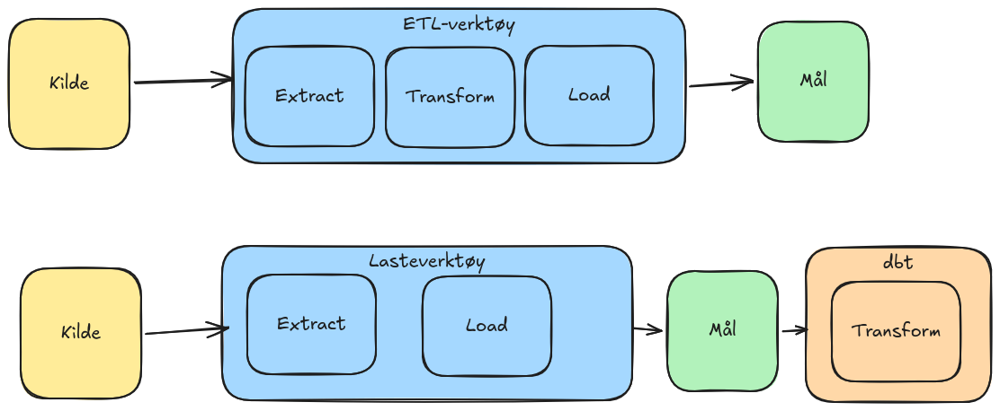

<!-- _class: title -->

<div class="tag">Sesjon 1 av 5</div>

# Den moderne datastakken
# og dbt sin rolle

**Varighet:** 3 timer &nbsp;·&nbsp; **Datasett:** jaffle-shop

---

## Agenda

<br>

1 — Motivasjon
2 — Hva er dbt
3 — Oppsett
4 — Testkjøring

---

<!-- _class: divider -->

# 1
Motivasjon


---

## Tradisjonelle verktøy

### Hva fungerer
- Bygget av folk som kjenner dataene godt
- Ofte stabil i årevis
- Dyp SQL-kompetanse

### Hva fungerer mindre bra
- Vanskelig å versjonere
- Ingen systematisk måte å teste på
- Vanskelig å få oversikt over avhengigheter
- Implisitt vs eksplisitt kunnskap


---

## ETL vs. ELT



---

<!-- _class: divider -->

# 2 
dbt

---

## Hva er dbt
- Et transformasjonsrammeverk som kjører SQL SELECT-setninger
- Finner ut kjørerekkefølgen basert på avhengigheter mellom modeller (DAG)
- Pakker automatisk inn SELECT i `CREATE TABLE` eller `CREATE VIEW`
- Legger til testing, dokumentasjon og lineage

## Hva dbt ikke er

- Et ingestionsverktøy — henter ikke data fra kilder
- En loader — rå data må allerede ligge i målet
- En planlegger — kjøres av deg eller en orkestrator

 
---

## Ønskede egenskaper
- Idempotens: En operasjon kan gjenomføres 1, 2 eller 100 ganger uten at det påvirker resultatet utover første
- Deklarativ: Man beskriver ønsket tilstand, systemet tar seg av hvordan man kommer dit
  - Motsatt av Imperativ: Man beskriver nøyaktig prosedyre, steg for steg
- Lesbare endringer og enkel triage: "det gikk til h.. på mandag kl 14, hvilken endring ble gjort?"
- Enkelt å forstå hva som påvirkes
- Trygt samarbeid
- Enkel tilbakerulling
- Standardisering
- Automatisering
- Testbarhet
- Dokumentasjon
---

## Programvareutviklingsvinkelen

Modeller er `.sql`-filer i en mappe:

- De bor i Git — historikk, diff, blame
- De blir gjennomgått i pull requests
- Du ser nøyaktig hva som endret seg, når og av hvem
- Hele prosjektet kan bygges på nytt i et ferskt miljø på kort tid

---

## Vanlig støttefunksjonalitet
- Versjonskontroll: Alle datamodeller definert som kode, hvor alle versjoner er lagret i et repo
- CICD: Automatiserer prosessen med å ta modeller fra `utvikling` -> `test` -> `prod`
  - Isolerte miljøer
  - Testing
  - Linting
  - Opprydding
- Orkestrering: Hva skal kjøre når, starte jobber


---

<!-- _class: divider -->

## 3
Oppsett

---


<!-- _class: divider -->

# 4
Første modell


---

## Struktur

```
jaffle-shop/
├── dbt_project.yml    # prosjektkonfig
├── profiles.yml       # tilkoblingskonfig
├── models/            # SQL-filer — her skjer arbeidet
│   ├── staging/
│   └── marts/
├── seeds/             # CSV-filer → tabeller
├── tests/             # egendefinerte tester
└── macros/            # gjenbrukbare funksjoner
```

---

## Jaffle-shop datamodell

```
customers:   id, name
orders:      id, customer_id, store_id, ordered_at,
             subtotal, tax_paid, order_total
order_items: id, order_id, product_id
products:    id, name, price, type
stores:      id, name, opened_at, tax_rate
supplies:    id, product_id, name, cost, perishable
```

---

## Kjør eksisterende modeller

```bash
dbt run
```

Gå til BigQuery — tabellene dukket opp i ditt datasett.

<br>

Én kommando. Tabeller materialisert i lageret. Det er dbt.

---

## Les en modellfil sammen

`models/staging/stg_orders.sql` — legg merke til:

```sql
with source as (
    select * from {{ source('ecom', 'raw_orders') }}
),
renamed as (
    select
        id          as order_id,
        customer    as customer_id,
        ordered_at,
        subtotal / 100.0    as subtotal,
        tax_paid / 100.0    as tax_paid
    from source
)
select * from renamed
```

Enkelt: **omdøp, kast typer, ingenting annet.** Ingen joins eller forretningslogikk.

---

## `ref()` — det viktigste begrepet i dbt

```sql
with customers as (
    select * from {{ ref('stg_customers') }}
),
orders as (
    select * from {{ ref('stg_orders') }}
)
...
```

`ref()` kompileres til riktig skjemanavn automatisk:

```sql
-- du skriver:
select * from {{ ref('stg_orders') }}

-- dbt kompilerer til:
select * from `prosjekt.dbt_fornavn.stg_orders`
```

---

## Hva `ref()` gir deg

- Modeller **erklærer avhengigheter** til hverandre — ikke hardkodede tabellnavn
- dbt bygger **kjørerekkefølgen automatisk** fra referansene
- `stg_orders` kjøres **alltid** før `customers`
- En SQL-setning som fungerer i **alle miljøer** — dev, staging, prod

---

## DAG-en

```bash
dbt docs generate
dbt docs serve
```

```
raw_customers ──► stg_customers ──┐
                                  ├──► customers (mart)
raw_orders ──────► stg_orders ────┤
                                  └──► orders (mart)
raw_order_items ─► stg_order_items ──► (brukt i joins)
raw_products ────► stg_products ─────► (brukt i joins)
```

-
---

## Øvelse 2 — Selvstendig

Lag `models/staging/stg_supplies.sql`:

```sql
with source as (
    select * from {{ source('ecom', 'raw_supplies') }}
),
renamed as (
    select
        id              as supply_id,
        product_id,
        name,
        cost / 100.0    as cost,
        perishable
    from source
)
select * from renamed
```

```bash
dbt run -s stg_supplies
```

---

## Øvelse 2 — Strekk

Lag `models/marts/fct_product_revenue.sql`:

- Join `stg_order_items` og `stg_products` med `ref()`
- Beregn total omsetning per produkt

**Forventede kolonner:**
`product_id` · `product_name` · `product_type` · `total_items_sold` · `total_revenue`

---

## Nøkkelbegreper — oppsummering

- **ETL vs. ELT** — transformasjon inne i lageret, ikke på vei inn
- **dbt-modell** — en `.sql`-fil med en SELECT-setning
- **`ref()`** — slik modeller erklærer avhengigheter til hverandre
- **DAG** — avhengighetsgrafen dbt bygger fra `ref()`-kall
- **`dbt run`** — materialiserer alle modeller i riktig rekkefølge

---

## Vanlige spørsmål

**«Hva er forskjellen fra stored procedures?»**
SQL-en ligner. Forskjellen er alt rundt: Git-historikk, avhengighetsgraf, testbarhet, reproduserbarhet.

**«Hva med inkrementelle laster?»**
Det dekker `incremental`-materialiseringen. Sesjon 2.

**«Hvem kjører `dbt run` i produksjon?»**
En orkestrator — Airflow, Cloud Composer, eller dbt Cloud. Sesjon 5.

**«Vi bruker dbt Cloud — hvorfor Core her?»**
SQL-en er identisk. Core lærer grunnlaget. Sesjon 5 mapper det til Cloud.

---


## Kommandoer

| Kommando | funksjon |
| --- | --- |
| `debug`| Sjekk tilkobling og konfigurasjon |
| `run` | Kjør en eller flere modeller |
| `test`| Test en eller flere modeller |
| `build`| Kjør og test en eller flere modeller |
| `docs` | Kommandoer knyttet til dokumentasjon (`generate` og `serve`)
| `seed` | Last opp seed-filer til database

---

## Viktige filer og mapper
| navn | funksjon |
| ---  | --- |
| `profiles.yml` | Definerer tilkobling og authentisering mot databasen/databasene |
| `dbt_project.yml` | Definerer konfigurasjon og struktur for selve prosjektet |
| `manifest.json` | Inneholder generert definisjon av prosjektet; tabeller, lineage, tester, relasjoner osv |
| `models/` | Alle modellene som er definert (views, tables)
| `seeds/` | Referansedata i CSV-format, som kan lastes til databasen |
| `analyses/` | Ad-hoc spørringer
| `macros/` | Gjenbrukbare funksjoner
| `target/`| Generert kode fra kjøring av modellene

---
